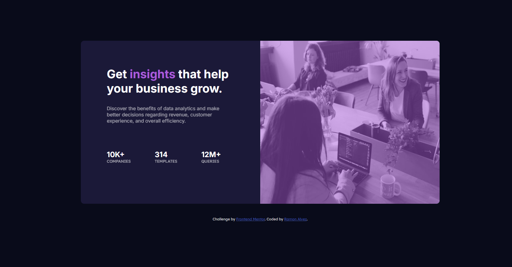

# Frontend Mentor - Stats preview card component solution

This is a solution to the [Stats preview card component challenge on Frontend Mentor](https://www.frontendmentor.io/challenges/stats-preview-card-component-8JqbgoU62). Frontend Mentor challenges help you improve your coding skills by building realistic projects. 

## Overview

### The challenge

Users should be able to:

- View the optimal layout depending on their device's screen size

## Screenshot

- ### Desktop


- ### Mobile


### Links

- Solution URL: [FrontEnd Mentor](https://www.frontendmentor.io/solutions/-html5-e-css-9-newbie-stats-preview-card-J2PP9o9gBZ)

- Live Site URL: [Live Site](https://ramon-alvez.github.io/Frontend-Mentor-HTML-CSS-Newbie-Stats-Preview-Card/)

## My process

### Built with

- Semantic HTML5 markup
- CSS custom properties
- Flexbox

### What I learned

I confess that I had a little difficulty with the image mask, as the color provided by them was not as similar as the image, I ended up wasting time looking for some "perfect color", but I ended up leaving the same, because if the general design of the page changed, you would just configure the variable and all the elements would change along with it.

```css
.card 
    .card-header .header-image
    {
    width: 100%;
    height: 100%;

    border-radius: 0 10px 10px 0;
}

.card 
    .card-header .header-image::after
    {
    content: '';
    background-color: var(--Accent, hsla(277, 93%, 28%));
    opacity: 0.5;
    width: 100%;
    height: 100%;
    display: block;
    position: absolute;

    border-radius: 0 10px 10px 0;
}
```

Responsivity too:

```css
 .card 
        .card-header .header-image{
        border-radius: 10px 10px 0 0;
        display: flex;
    }

    .card 
        .card-header .header-image::after
        {
            border-radius: 10px 10px 0 0;
            height: 100%;
    }
```

In responsivity case I had a problem with the mask size, because this height surpases the image height a little, but I remmembered that with display:flex in the "dad", the "son" suits the height of the "dad" content. 

Another part that ended up breaking my head a little was the responsiveness on medium screens, the two images (desktop and mobile) have almost identical sizes, and I thought that the break in the media query was getting strange, but after spending more time testing the things I think I ended up finding a good in between size.

### Continued development

My current goal is to finish all the FrontEnd Mentor challenges, to train and learn in the process.

## Author

- GitHub - [Ramon Alvez](https://github.com/Ramon-Alvez)
- Frontend Mentor - [@Ramon Alvez](https://www.frontendmentor.io/profile/Ramon-Alvez)
- LinkedIn - [@Ramon Alvez](https://www.linkedin.com/in/ramon-alvez/)
